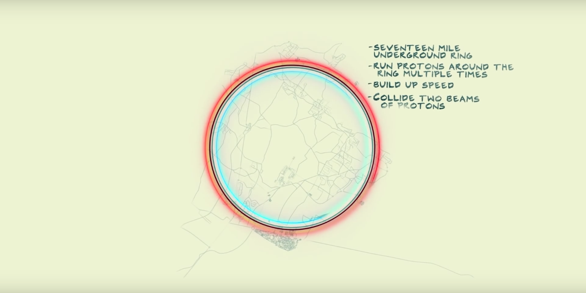

# Particle Fever

# [](http://github.com/vertexclique/particlefever)
**Akka Actor System Tree Resolver**

Particle Fever is Akka Actor Tree resolver for debugging your ActorSystem actors and how they are organized their hierarchy.

## Installation

```scala
val particleFever = "com.vertexclique" %% "particlefever" % "0.1.0"

libraryDependencies += particleFever
```

## Usage

You can debug your ActorSystem with:

```scala
val tree = ParticleFever().getTree
```

to get tree and if you want to print tree you can use:

```scala
ParticleFever().printTree
```
